# Planty: Autonomous AI Ecosystem for Plant Pathology 🌿🧬

**[🇬🇧 English](#-english-whitepaper) | [🇺🇦 Українська](#-українська-наукова-документація)**

---

> 🎓 **Academic Context:** This repository contains the practical implementation of the Bachelor's Thesis: *"Research and Software Implementation of Neural Network Models for Plant Disease Classification"*.
> **Research Duration:** 6 months (5 months dedicated to Architecture Search).
> **Publications:**
> * 📄 *Proceedings of the II International Scientific Conference "Information Technologies in Environmental Protection" (ITEP-2025).*
> * 📄 *Proceedings of the International Conference "Information Technologies in Metallurgy and Machine Building" (ITMM-2025).*
> * 📄 *Article in the collective monograph "Information Technologies in Environmental Protection".*
> 
> 

---

# EN

## 🧠 1. The "Planty-Net" Proprietary Architecture

The core innovation of this project is a **custom-designed Hybrid CNN architecture**, engineered from scratch through an iterative process of over **100 experiments**. Unlike standard transfer learning (MobileNet, ResNet), this model was tailored specifically for the texture-rich domain of plant pathology.

### 🏗️ Architecture Specification

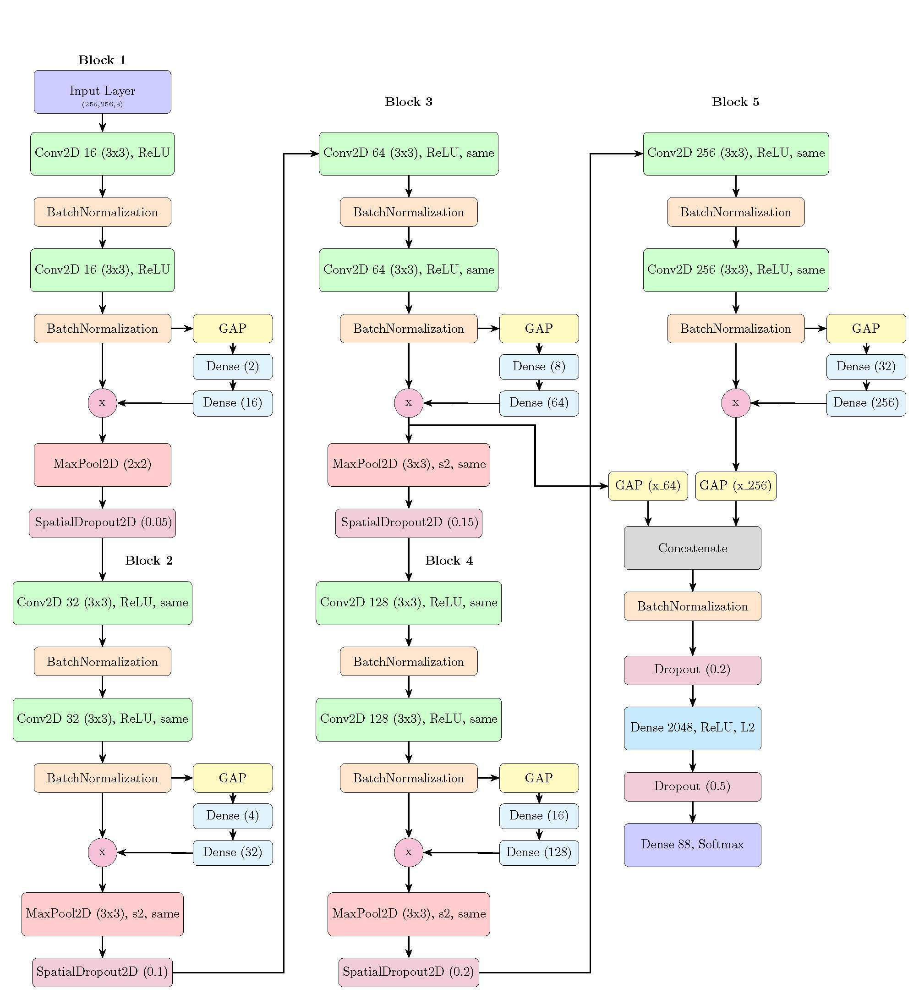

The final topology consists of **5 sequential feature extraction blocks** followed by a classification head.

1. **Convolutional Blocks (1-5):**
* **Conv2D:** High-frequency feature extraction (ReLU activation).
* **Batch Normalization:** Stabilizes learning and accelerates convergence.
* **SE-Block (Squeeze-and-Excitation):** A critical addition that recalibrates channel-wise feature responses, allowing the network to focus on relevant feature maps (e.g., distinguishing rust texture from leaf veins).
* **MaxPooling2D:** Dimensionality reduction.
* **SpatialDropout2D:** Prevents overfitting by dropping entire feature maps rather than individual pixels.

2. **Multi-Scale Feature Fusion (Innovation):**
* The model implements a **skip-connection strategy**: features from **Block 3** (64 filters, mid-level abstraction) are concatenated with features from **Block 5** (256 filters, high-level abstraction) via `GlobalAveragePooling2D` and `Concatenate` layers.
* This preserves vital texture information that is often lost in deep layers of standard architectures.

3. **Classification Head:**
* **Dense Layers:** With **L2 Regularization** and aggressive **Dropout** to prevent overfitting.
* **Softmax:** Output probability distribution for **88 classes**.

### 📊 Performance Benchmarks (Test Set)

The custom model demonstrates superior efficiency compared to SOTA mobile models on the *Plant Disease Classification Merged Dataset*.

| Model Architecture | Parameters | Accuracy (Test) |
| --- | --- | --- |
| MobileNetV1 | ~5.5M | 92.6% |
| MobileNetV3-Large | ~3.0M | 89.9% |
| EfficientNetB0 | ~6.0M | 89.4% |
| **Planty-Net (Custom)** | **~2.0M** | **95.1%** 🏆 |

**Conclusion:** The proprietary architecture achieves the highest accuracy with significantly fewer parameters (~2M), making it the optimal choice for battery-powered edge devices where the balance between accuracy, model size, and computational resources is critical.

---

## 🔬 2. Scientific Methodology

### 📂 The Dataset

The model was trained on the **"Plant Disease Classification Merged Dataset"**:

* **Source:** Aggregated from 14 existing open-source repositories (including PlantVillage).
* **Volume:** 79,000+ original images spanning **88 classes** of diseased and healthy plants.
* **Conditions:** Contains both controlled laboratory images and "in-the-wild" field photos.
* **Balancing:** To address class imbalance, the training set was expanded to **264,000 images** (3,000 per class) using augmentation techniques:
  * Rotation, Scaling, Mirroring.
  * Color jittering (brightness/contrast changes).
  * Gaussian noise injection.

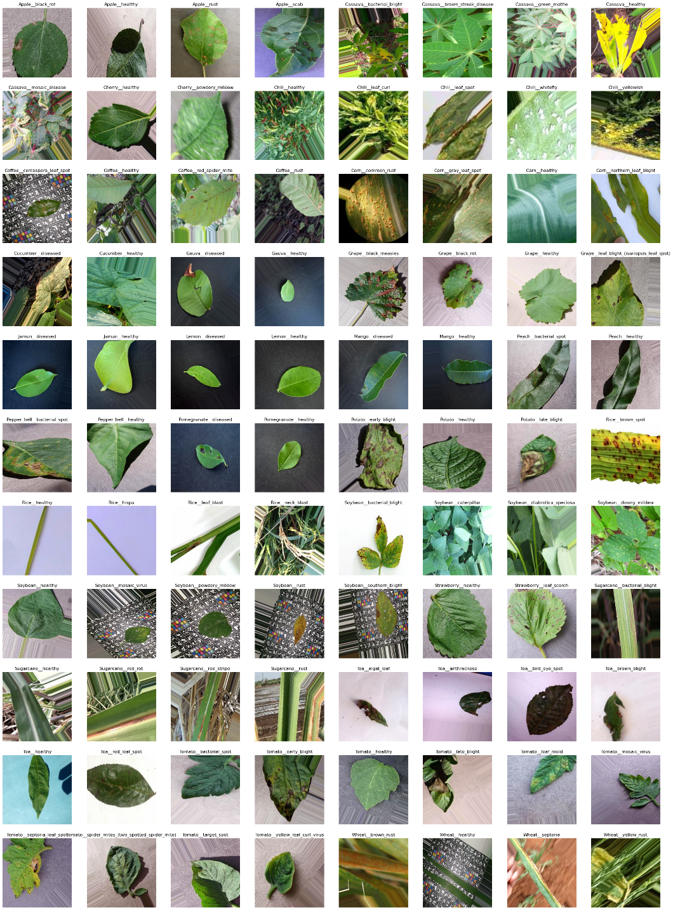

### ⚙️ Training Hyperparameters

* **Optimizer:** SGD with Momentum (Nesterov).
* **Scheduler:** Cosine Decay (smooth learning rate annealing).
* **Epochs:** 70 (Convergence achieved at ~65).
* **Metrics:** 96.3% Training Accuracy / 95.1% Test Accuracy.
* **Regularization:** L2 + SpatialDropout2D + BatchNormalization.

### 🎨 Research: Color Spaces

A comparative study was conducted to determine the optimal color space for feature extraction.

* **Result:** **RGB** consistently outperformed LAB, HSV, and LUV.
* **Insight:** In plant pathology, the correlation between Red, Green, and Blue channels encodes critical biological information about necrosis stages that is lost when channels are decorrelated (as in LAB).

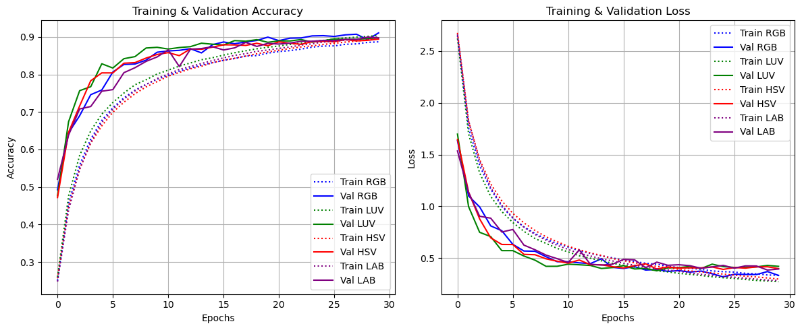

### 👁️ Explainable AI (XAI)

**Score-CAM** was utilized to validate the model's decision-making process. Heatmaps confirmed that the **SE-Blocks** successfully directed attention to lesion areas on convolutional layers before and after SE blocks, ignoring background noise.

---

## 📱 3. Application Ecosystem Features 

The Android application is a full-featured tool developed using **Kotlin** and **Jetpack Compose** (Material Design 3). It implements a comprehensive set of Use Cases defined during the analysis phase.

### 🏛️ Application Architecture

* **Pattern:** MVVM (Model-View-ViewModel) + Clean Architecture.
* **Presentation Layer:** Jetpack Compose functions observing `StateFlow` from ViewModels.
* **Domain Layer:** Pure Kotlin UseCases encapsulating business logic.
* **Data Layer:** Repositories managing data from Room, Firebase, and Retrofit.

### 👥 Actors & Integrations

* **User (Agronomist):** Initiates diagnosis and consumes data.
* **TFLite Model (Embedded):** Performs offline inference.
* **WeatherAPI Service:** Provides meteorological context.
* **Google Maps API:** Enables GIS visualization.
* **Firebase (Cloud):** Handles data synchronization and feedback collection.

### 🌿 Detailed Use Case Scenarios

#### 1. AI-Powered Diagnosis (Core System)

The primary workflow allowing users to identify plant pathologies.

* **Image Selection:** Supports real-time capture via **CameraX** (with custom laser UI) or selection from the system **Gallery**.
* **Classification Process:** Automatic preprocessing (scaling to 256x256, normalization, rotation) followed by local **TFLite** inference.
* **Result Analysis:** Displays disease name, confidence score, and treatment protocols.
* **Local Archiving:** Automatic persistence of results via **Room Database**.
* **Optional Enhancements:** Geolocation tagging and cloud backup for scientific research.

#### 2. History & Feedback Loop

* **History Management:** Browse past diagnoses grouped by date with full search capabilities.
* **Interactive Results:** View records on a map, share diagnostic reports, or provide feedback.
* **RLHF (Feedback):** Mechanism for users to correct the AI, sending data to Firebase to improve future models.

#### 3. Encyclopedia & Knowledge Base

* **Botanical Guide:** Detailed profiles for plants (soil, water, light requirements) and diseases (symptoms, treatment).
* **Smart Search:** Fuzzy search for quick access to the database with search history.
* **Favorites:** Personal list of frequently accessed plants or diseases for quick offline viewing.

#### 4. Environment Monitoring

* **Meteorological Data:** Real-time dashboard showing temperature, humidity, and moon phases (crucial for biodynamic farming).
* **Epidemiology Mapping:** Visualizes diagnosis locations on an interactive map using clustering to identify disease outbreak clusters.

---

# 🇺🇦

## 🧠 1. Авторська Архітектура "Planty-Net"

Ключовим досягненням роботи є **власна гібридна архітектура CNN**, розроблена "з нуля" в результаті ітеративного процесу, що включав понад **100 експериментів**. Модель еволюціонувала від простих мереж до складних структур з механізмами уваги.

### 🏗️ Деталі Архітектури

Фінальна модель складається з **5 послідовних блоків** та класифікаційної частини:

1. **Структура Блоку:**
* `Conv2D` (ReLU): Виділення високочастотних ознак.
* `BatchNormalization`: Стабілізація градієнтів та прискорення навчання.
* **`SE-Block` (Squeeze-and-Excitation):** Інтегрований модуль уваги для калібрування канальних ознак. Дозволяє моделі фокусуватися на важливих картах ознак (наприклад, текстура іржі).
* `MaxPooling2D`: Зменшення розмірності.
* `SpatialDropout2D`: Боротьба з перенавчанням шляхом виключення цілих карт ознак.

2. **Об'єднання Ознак (Feature Fusion):**
* Реалізовано механізм, що об'єднує виходи **3-го блоку** (64 фільтри, середній рівень абстракції) та **5-го блоку** (256 фільтрів, високий рівень) через `GlobalAveragePooling2D` та `Concatenate`.
* Це дозволяє враховувати як глобальну форму плями, так і її мікро-текстуру.

3. **Класифікатор:** Повнозв'язні шари (`Dense`) з `Dropout`, `L2`-регуляризацією та вихідним шаром `Softmax` на 88 класів.

### 📊 Порівняльна Ефективність

Розроблена модель демонструє найвищу точність при значно меншій кількості параметрів, що робить її оптимальною для мобільних пристроїв.

| Архітектура | Параметри | Точність (Test) |
| --- | --- | --- |
| MobileNetV1 | ~5.5 млн | 92.6% |
| MobileNetV3-Large | ~3.0 млн | 89.9% |
| EfficientNetB0 | ~6.0 млн | 89.4% |
| **Planty-Net (Власна)** | **~2.0 млн** | **95.1%** 🏆 |

---

## 🔬 2. Наукова Методологія

### 📂 Набір Даних (Dataset)

* **База:** "Plant Disease Classification Merged Dataset" (об'єднання 14 існуючих наборів даних).
* **Обсяг:** 79,000 оригінальних зображень -> **264,000 після аугментації** (збалансовано до 3000 зображень на клас).
* **Класи:** 88 класів (хворі та здорові рослини).
* **Аугментація:** Обертання, масштабування, віддзеркалення, зміна колірних характеристик, додавання шуму.

### ⚙️ Навчання

* **Оптимізатор:** SGD with Momentum.
* **Планувальник:** Косинусне загасання швидкості навчання (Cosine Decay).
* **Епохи:** 70 (Результат 95.1% на тестовій вибірці).

### 🎨 Дослідження: Колірні Простори

Досліджувався вплив просторів **RGB, LAB, HSV**. Результати показали перевагу **RGB**, оскільки кореляція каналів містить унікальні біологічні маркери хвороб, які руйнуються при переході в LAB/HSV.

### 👁️ Інтерпретованість (XAI)

Використано метод **Score-CAM** для візуалізації впливових ділянок на згорткових шарах (до та після SE-блоків). Це підтвердило, що модель приймає рішення на основі аналізу патологій, а не фону.

---

## 📱 3. Функціональні Можливості

Застосунок розроблено в **Android Studio** мовою **Kotlin** з використанням **Clean Architecture**.

### 🛠 Технічний Стек

* **UI:** Jetpack Compose (Material Design 3), анімації, адаптивна верстка.
* **Асинхронність:** Kotlin Coroutines & StateFlow.
* **DI:** Hilt (Dagger).
* **Local Data:** Room Database (SQLite) для історії та обраного.
* **Remote Data:** Retrofit (Weather API), Firebase.
* **ML Core:** TensorFlow Lite (On-Device Inference).

### 🌿 Деталізація Сценаріїв (Use Cases Breakdown)

#### 1. Діагностика Хвороб (Основний процес)

Центральний сценарій взаємодії користувача з системою.

* **Вибір джерела:** Фото через **CameraX** (з лазерним фокусом) або файл з галереї.
* **Класифікація:** Попередня обробка та локальний інференс моделі **TFLite** без доступу до мережі.
* **Результати:** Перегляд діагнозу, впевненості моделі та агротехнічних рекомендацій.
* **Локальне збереження:** Автоматичний запис результату в базу даних Room.
* **Додатково:** Можливість додавання геолокації та анонімного завантаження даних на Firebase для науки.

#### 2. Історія та Зворотний Зв'язок

* **Журнал діагностик:** Перегляд історії, згрупованої за датами, з функцією пошуку.
* **Взаємодія з записами:** Відображення місця сканування на карті, поширення результатів або надсилання виправленого діагнозу.
* **RLHF (Active Learning):** Зворотний зв'язок від користувача для подальшого покращення точності нейромережі.

#### 3. Довідник та База Знань

* **Агро-енциклопедія:** Детальна інформація про догляд за рослинами, симптоми хвороб та методи лікування.
* **Пошук:** Глобальний пошук по всій базі культур та патологій.
* **Обране:** Керування персоналізованим списком рослин для швидкого офлайн-доступу.

#### 4. Зовнішні Інтеграції

* **ГІС-Карта:** Візуалізація маркерів діагностик на Google Maps та аналіз епідеміологічних вогнищ.
* **Метеорологія:** Віджет погоди з фазами місяця для планування польових робіт (біодинамічне землеробство).

---

## 🚀 Напрямки подальшого розвитку

* Розширення бази шкідників та симптомів дефіциту речовин.
* Дослідження новітніх архітектур (**Vision Transformers**).
* Перехід від класифікації до **детекції** (Object Detection) або **сегментації** уражених ділянок.

## 📸 Visual Demonstration

### AI Analysis & Research

| Laser Scanning UI | Prediction & Confidence | Score-CAM Heatmap (Research) |
| --- | --- | --- |
| 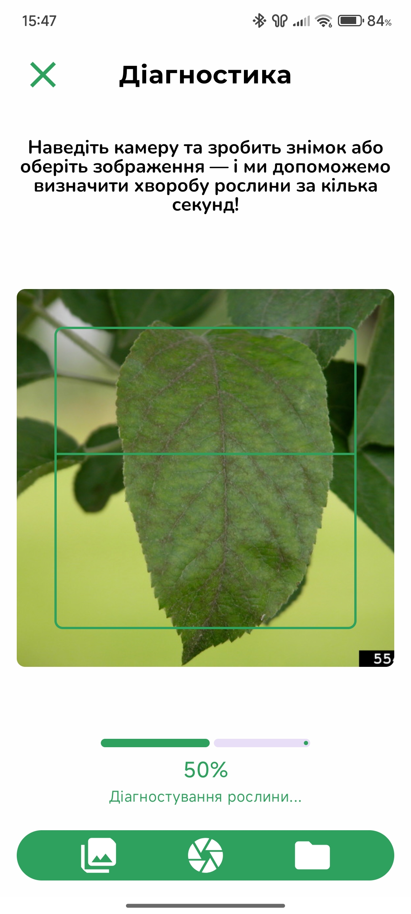 | 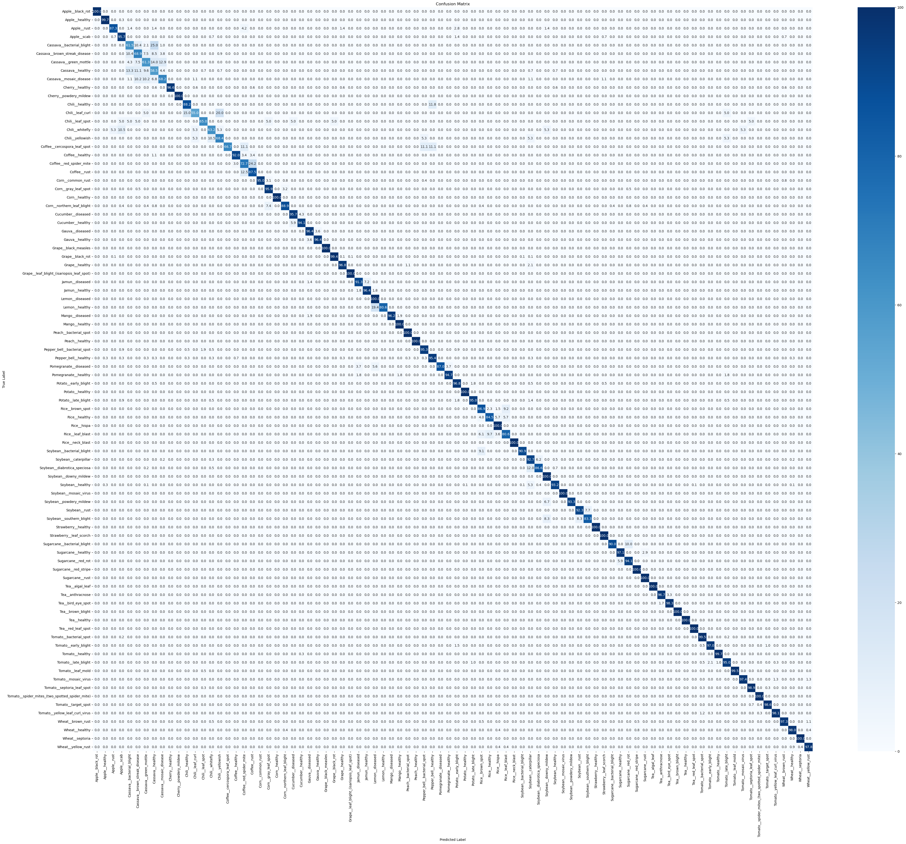 |  |
| *Smart Capture Interface* | *95.1% Accuracy Model* | *Attention Visualization* |

### Ecosystem Modules

| Disease Mapping (GIS) | Weather & Moon Phases | History |
| --- | --- | --- |
| 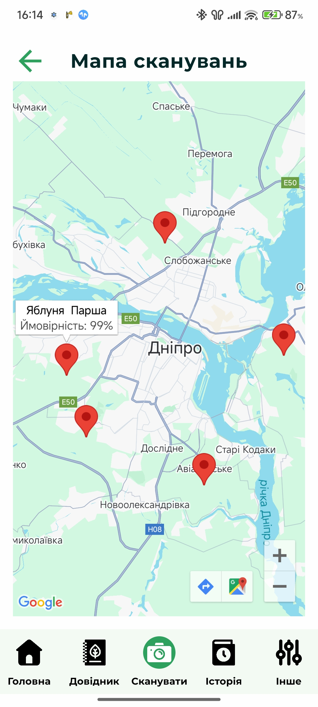 | 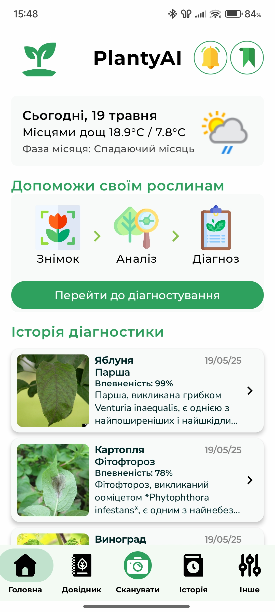 | 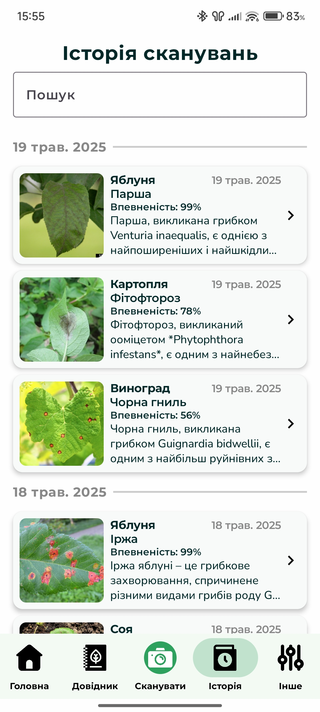 |
| *Outbreak Tracking* | *Agro-Meteorology* | *Local History Base* |

| Results | Bookmarks | Settings |
| --- | --- | --- |
|  |  | 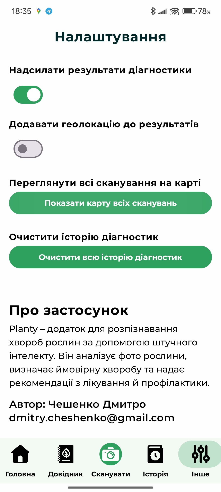 |
| *Result Analysis* | *Bookmarks: Plants or Diseases* | *Settings and Map* |

<table>
    <thead>
        <tr>
            <th colspan="3" style="text-align: center;">Encyclopedia</th>
        </tr>
    </thead>
    <tbody>
        <tr>
            <td>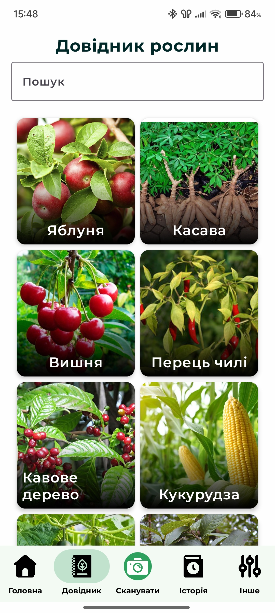</td>
            <td>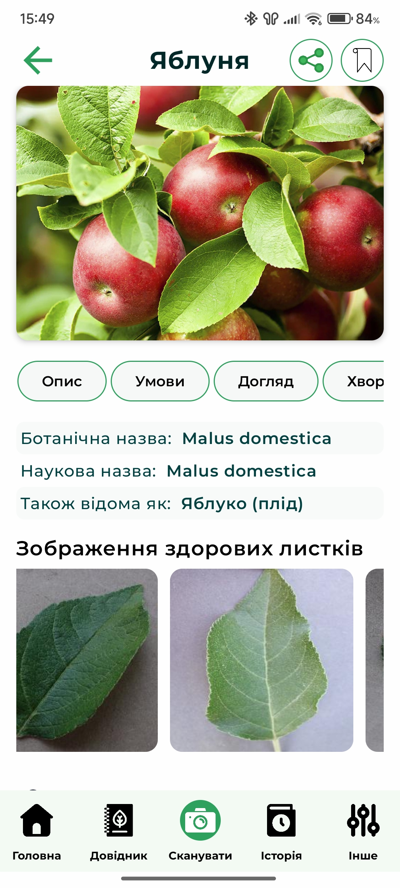</td>
            <td>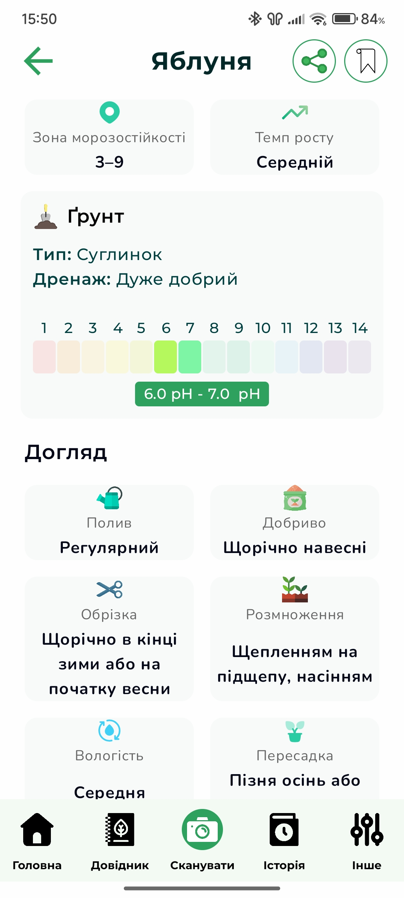</td>
        </tr>
        <tr>
            <td>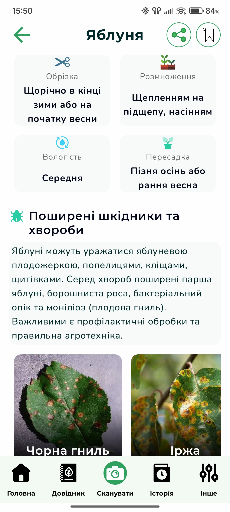</td>
            <td>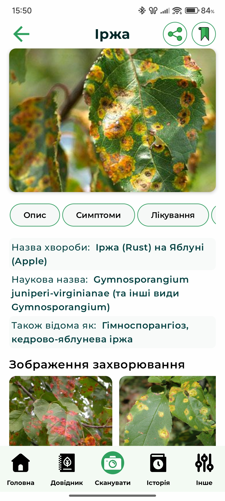</td>
            <td>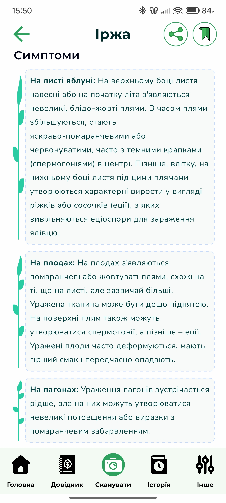</td>
        </tr>
    </tbody>
    <tfoot>
        <tr>
            <td colspan="3" style="text-align: center;"><em>Local Knowledge Base</em></td>
        </tr>
    </tfoot>
</table>

<table>
    <thead>
        <tr>
            <th colspan="3" style="text-align: center;">Gifs</th>
        </tr>
    </thead>
    <tbody>
        <tr>
            <td></td>
            <td></td>
            <td></td>
        </tr>
    </tbody>
</table>

## 🚀 Installation

1. **Clone Repository**
2. **Config:** Create `apikeys.properties` in root with `WEATHER_API_KEY` and `GOOGLE_MAPS_KEY`.
3. **Firebase:** Add `google-services.json` to the `/app` folder.
4. **Run:** Build on physical Android device (min SDK 28).

---

### 👤 Author & Researcher

**Dmytro Cheshenko**

*Student of Oles Honchar Dnipro National University*

*Faculty of Applied Mathematics and Information Technologies*

  **Thesis Supervisor:** Docent O.M. Matsuha

Copyright © 2025 Dmytro Cheshenko. All Rights Reserved.